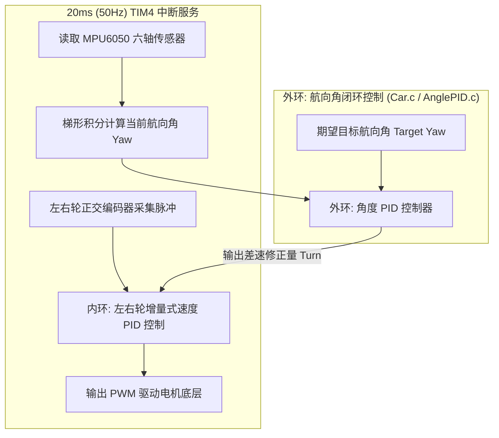
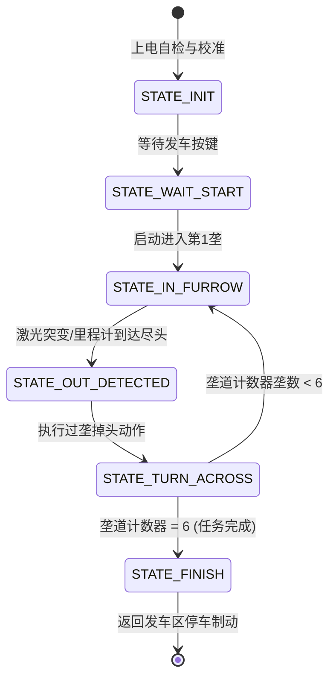

# 智能农业机器人 - 双轮差速底盘控制系统

本项目为**第十一届全国大学生智能农业装备创新大赛（校赛/省赛 B类）**自走式作业机器人电控底层工程。
主控芯片采用 **STM32F103**，底层采用**双闭环控制架构（内环轮速 PID + 外环航向角 PID）**，支持高精度直线保持与定角度原地自转，为后续激光测距与全场自主作业状态机提供稳定的底盘运动支持。

---

## 📌 硬件架构与引脚分配

| 硬件外设 | 信号线 / 功能 | STM32 引脚 | 备注 / 接口说明 |
| :--- | :--- | :--- | :--- |
| **MPU6050** | I2C_SDA / I2C_SCL | **PA4 / PA5** | 软件模拟 I2C，用于航向角（Yaw）闭环控制 |
| **OLED 屏幕** | I2C_SCL / I2C_SDA | **PA2 / PA3** | 0.96 寸 OLED，用于实时监控角度和角速度 |
| **左电机驱动** | PWM / 方向控制 | **PA0 (TIM2_CH1) / PB0, PB1** | 定时器 PWM 调速 + 双逻辑脚控制方向 |
| **右电机驱动** | PWM / 方向控制 | **PA1 (TIM2_CH2) / PB12, PB13**| 定时器 PWM 调速 + 双逻辑脚控制方向 |
| **左编码器** | A相 / B相 (正交编码)| **PA6 / PA7 (TIM3)** | 硬件正交编码器接口测速 |
| **右编码器** | A相 / B相 (正交编码)| **PB6 / PB7 (TIM4)** | 硬件正交编码器接口测速 |
| **调试串口** | USART3_TX / RX | **PB10 / PB11** | 波特率 **9600**，用于串口助手/蓝牙输出调参数据 |
| **激光测距 (预留)**| VL53L1X I2C / XSHUT | **PA4, PA5 (共用I2C) / 待定GPIO** | 计划用于田埂侧方测距与尽头检测 |

---

## 🔄 对比初始版本的重大改动与重构


### 1. 控制算法层重大升级（开环 -> 航向角双闭环）
*   **新增外环角度控制器（`Hardware/AnglePID.c/h`）**：
    *   构建了**“外环角度修正 -> 内环速度闭环 -> 电机 PWM 输出”**的双闭环控制模型。
*   **运动级动作函数封装（`Hardware/Car.c/h`）**：
    *   新增 `Turn_To_Angle(float target_angle)`：双闭环原地定角自转，内置稳定收敛检测（连续 5 周期误差 $\le 1.5^\circ$ 且角速度 $\le 3.0^\circ/s$）与 3 秒超时防卡死退出保护。
    *   新增 `Turn_Left_90()` 与 `Turn_Right_90()` 原地直角自转指令。
    *   新增 `Car_DriveStraight(float base_speed, float target_yaw)`：指定期望航向角定速巡航直行，利用外环 PID 输出左右差速实时抵抗地面摩擦不均（如地毯过渡）引发的跑偏。

### 2. 彻底解决硬件引脚冲突与冗余清理
*   **解除致命引脚冲突**：
    *   原工程中的灰度循迹模块（`Gray.c`）占用了 `PA2~PA7`，导致 `PA4/PA5`（MPU6050 软件 I2C）和 `PA2/PA3`（OLED）被强行重设为模拟输入（AIN），导致 I2C 通信锁死报错。现已彻底移除冲突模块。
*   **清理与比赛规则不符或冗余的硬件驱动（并同步清理 Keil 工程树）**：
    *   ❌ `Gray.c / Gray.h`：比赛场地为无引导线田埂，由激光测距替代；
    *   ❌ `ADC_DMA.c / ADC_DMA.h`：原模拟量灰度采样，现已无用；
    *   ❌ `BT.c / BT.h`：比赛禁止遥控，移除遥控控制逻辑；
    *   ❌ `HCSR04.c / HCSR04.h`：超声波波束角大且易受田埂凹凸干扰，后续由高精度激光替代；
    *   ❌ `Servo.c / Servo.h`：双轮差速底盘无需舵机转向；
    *   ❌ `LED.c / LED.h` & `Key.c / Key.h`：引脚冲突且暂未分配新引脚；
    *   ❌ `Buzzer.c / Buzzer.h`：原为空壳文件，已移除。
*   **独立串口遥测能力（`Hardware/Serial_Printf.c/h`）**：
    *   从被删除的蓝牙模块中抽离并重构了纯净的 `USART3` 硬件底层（PB10/PB11, 9600波特率），使小车摆脱遥控依赖的同时，依然具备向 PC 上位机实时输出遥测数据与 PID 曲线的能力。


---

## ⚙️ 软件核心控制架构



---

## 🗓️ 后续开发规划与测试指南

结合竞赛规则（390×300cm 场地，6 条 40cm 宽垄道，2 条随机铺设 5.5mm 卡其色地毯，全自动遍历并返回起点），团队后续规划分为四个递进阶段：

### 阶段一：航向角闭环平地与架空验证（当前阶段，立即进行）
> 🎯 **目标**：在不依赖垄道的前提下，验证外环角度 PID 和内环速度 PID 的稳定性。

*   **测试 1：架空抗扭阻力测试（验证极性）**
    *   **操作**：底盘悬空，调用 `Car_DriveStraight(30, 0)`。
    *   **检验标准**：手水平向左扭动车体，右轮加速、左轮减速（或反转），车身产生抵抗手扭的外力矩；反之亦然。
*   **测试 2：原地左/右 90° 旋转测试（验证响应与超调）**
    *   **操作**：地面放置小车，调用 `Turn_Left_90()`。
    *   **检验标准**：小车原地自转到 90° 附近平稳减速刹停，无严重来回剧烈晃动，超调量 $\le 3^\circ$，稳定误差 $\le 1.5^\circ$。
*   **测试 3：定角度直线巡航测试（验证抗扰偏能力）**
    *   **操作**：调用 `Car_DriveStraight(40, 0)` 直行 3 米。
    *   **检验标准**：地面行走 3 米横向跑偏距离不超过 5cm；用手轻推车体一侧，小车能迅速自动转回原设定航向。
*   **测试 4：“走正方形”综合闭环测试（基准验收）**
    *   **操作**：循环执行 4 次【直行 2 秒 -> 原地左转 90°】。
    *   **检验标准**：小车跑完 4 条边后能否精准回到起点附近，航向角是否保持闭合。

---

### 阶段二：VL53L1X 激光测距模块集成与沿垄直行（团队计划第 1 步）
> 🎯 **目标**：替代传统灰度，实现小车在 40cm 田埂垄道内稳定居中行驶。

*   **硬件部署**：
    *   小车左侧或两侧安装 VL53L1X 激光测距模块，利用独立 GPIO 控制 XSHUT 引脚区分从机地址。
*   **软件开发**：
    *   移植 VL53L1X ULD 精简固件库，配置测距模式为短距高速（Short Mode，最大 1.3m，测距周期 20ms~50ms）。
    *   编写测距滑动窗口均值滤波或中值滤波算法，滤除垄壁泥土起伏噪声。
    *   **沿垄双闭环算法**：将侧向测距距离误差转化为航向角期望偏差量（$Yaw_{target} = Yaw_0 + K_{wall} \cdot (Dist - Dist_{target})$），使小车具备沿垄壁自动修舵居中的能力。

---

### 阶段三：垄道尽头识别与过垄掉头（团队计划第 3 步）
> 🎯 **目标**：准确判断小车是否已经驶出当前垄道，并完成跨垄调头进入下一垄。

*   **出垄判断逻辑（双重冗余保障）**：
    1.  **激光测距突变判定**：侧向/前向激光测距值瞬间跳变至极大值（说明两侧垄壁消失，已出垄）。
    2.  **编码器里程计判定**：左右轮脉冲积分累计行程达到垄道长度（390cm 阈值附近）。
*   **跨垄调头动作序列规划**：
    1.  完全出垄固定距离（约 15~20cm）。
    2.  原地自转 90°。
    3.  盲走/测距横移一个垄宽（40cm）。
    4.  再次原地自转 90°，对准下一条垄道入口。
    5.  复位航向角基准，切入下一垄巡航。

---

### 阶段四：全场自主作业有限状态机（FSM）（团队计划第 4 步）
> 🎯 **目标**：编写顶层状态机，实现开机一键启动、全自动跑完 6 条垄道并返回原点。



---

## 📁 目录结构说明

```text
├── Hardware/               # 硬件驱动层
│   ├── AnglePID.c/h        # 航向角外环 PID 算法核心 (新增)
│   ├── app_mpu6050.c/h     # MPU6050 驱动、零偏校准与角度积分
│   ├── Car.c/h             # 小车运动级封装 (Turn_To_Angle, Car_DriveStraight)
│   ├── Control.c/h         # 速度内环控制与 20ms 更新周期调度
│   ├── Encoder.c/h         # 编码器输入捕获与计数读取
│   ├── Motor.c/h           # 电机正反转 GPIO 底层控制
│   ├── PWM.c/h             # 定时器 PWM 初始化与占空比配置
│   ├── PID.c/h             # 基础 PID 数据结构与运算
│   ├── OLED.c/h/Font.h     # 调试用 OLED 驱动
│   ├── Serial_Printf.c/h   # 串口打印与遥测驱动 (USART3, 9600)
│   └── SoftI2C.c/h         # 软件模拟 I2C 底层时序
├── System/                 # 系统基础库 (精确微秒/毫秒延时 Delay)
├── User/
│   ├── main.c              # 系统初始化、校准自检与测试主逻辑
│   ├── stm32f10x_it.c      # 中断服务函数 (含 20ms TIM4 中断)
│   └── stm32f10x_conf.h    # 标准外设库配置文件
├── library/                # STM32F10x 标准固件库
├── start/                  # CMSIS 核心与启动文件
└── Project.uvprojx         # Keil uVision5 工程配置文件
```

---

## 🛠️ 快速上手注意事项

1.  **上电静置**：开机后请保持小车静止平放 3 秒，待陀螺仪零偏校准完毕后方可搬动。
2.  **电池电压**：调试前请确保动力电池电压在标称工作范围内，低压会导致电机响应变慢影响 PID 参数表现。
