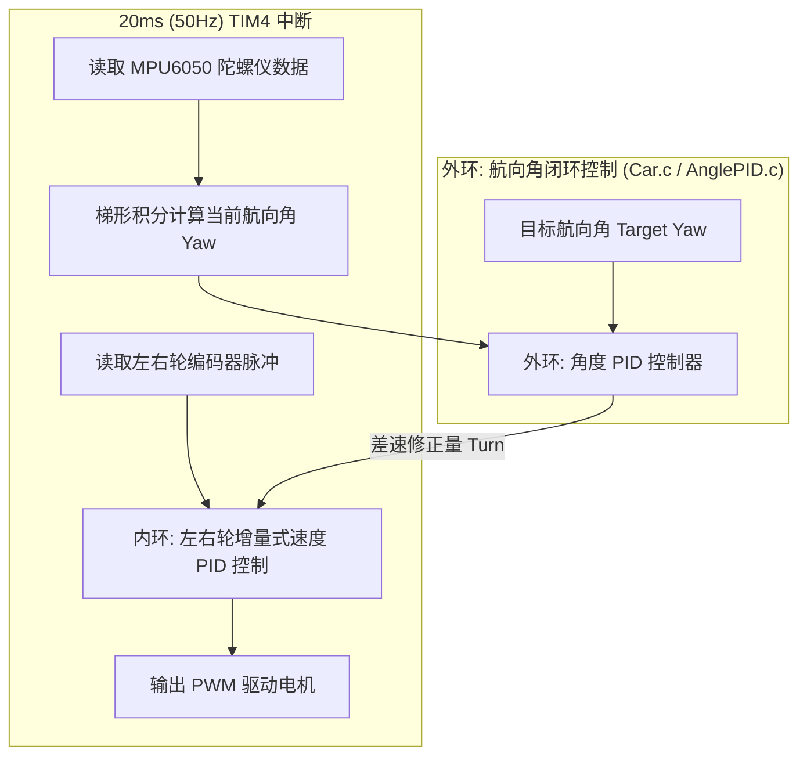

# 智能农业机器人 - 双轮差速底盘控制系统

本项目为**第十一届全国大学生智能农业装备创新大赛（校赛/省赛 B类）**自走式作业机器人电控底层工程。
主控芯片采用 **STM32F103**，底层采用**双闭环控制架构（内环轮速 PID + 外环航向角 PID）**，支持高精度直线保持与定角度原地自转，为后续激光雷达测距与全场自主作业状态机提供稳定的底盘运动支持。

---

## 📌 硬件架构与引脚分配

| 硬件外设 | 信号线 / 功能 | STM32 引脚 | 备注 / 接口说明 |
| :--- | :--- | :--- | :--- |
| **MPU6050** | I2C_SDA / I2C_SCL | **PA4 / PA5** | 软件 I2C，用于航向角（Yaw）闭环控制 |
| **OLED 屏幕** | I2C_SCL / I2C_SDA | **PA2 / PA3** | 0.96 寸 OLED，用于实时监控角度和角速度 |
| **左电机驱动** | PWM / 方向控制 | **PA0 (TIM2_CH1) / PB0, PB1** | 定时器 PWM 调速 + 双逻辑脚控方向 |
| **右电机驱动** | PWM / 方向控制 | **PA1 (TIM2_CH2) / PB12, PB13**| 定时器 PWM 调速 + 双逻辑脚控方向 |
| **左编码器** | A相 / B相 (正交编码)| **PA6 / PA7 (TIM3)** | 硬件正交编码器接口测速 |
| **右编码器** | A相 / B相 (正交编码)| **PB6 / PB7 (TIM4)** | 硬件正交编码器接口测速 |
| **调试串口** | USART3_TX / RX | **PB10 / PB11** | 波特率 **9600**，用于串口助手/蓝牙输出调参数据 |
| **激光测距 (预留)**| VL53L1X I2C / XSHUT | **PA4, PA5 (共用I2C) / 待定GPIO** | 计划用于田埂侧方测距与尽头检测 |

---

## ⚙️ 软件核心架构

系统采用严格的 **分层架构与周期性时间触发中断调度**：



### 1. 双闭环控制逻辑
*   **外环（角度环 - `AnglePID.c`）**：
    *   输入：目标航向角与 MPU6050 实时航向角之差。
    *   微分项（D项）：直接采用陀螺仪 Z 轴瞬时角速度 $g_z$，无相位延迟，抗抖动阻尼性能更强。
    *   输出：小车左右轮的差速修正量 `Turn`。
*   **内环（速度环 - `Control.c`）**：
    *   基于 TIM4 的 20ms 周期中断更新，根据外环输出的期望差速修正左右轮 PWM，确保即使地面摩擦不均（如地毯与塑料垫过渡）也能稳定走直线。

---

## 📁 目录结构说明

```text
├── Hardware/               # 硬件驱动层
│   ├── AnglePID.c/h        # 航向角外环 PID 算法核心
│   ├── app_mpu6050.c/h     # MPU6050 驱动、零偏校准与角度积分
│   ├── Car.c/h             # 小车运动级封装 (Turn_To_Angle, Car_DriveStraight)
│   ├── Control.c/h         # 速度内环控制与 20ms 更新周期调度
│   ├── Encoder.c/h         # 编码器输入捕获与计数读取
│   ├── Motor.c/h           # 电机正反转 GPIO 底层控制
│   ├── PWM.c/h             # 定时器 PWM 初始化与占空比配置
│   ├── PID.c/h             # 基础 PID 数据结构与运算
│   ├── OLED.c/h/Font.h     # 调试用 OLED 驱动
│   ├── Serial_Printf.c/h   # 串口打印工具函数 (USART3, 9600)
│   └── SoftI2C.c/h         # 软件模拟 I2C 底层时序
├── System/                 # 系统基础库 (精确微秒/毫秒延时 Delay)
├── User/
│   ├── main.c              # 系统初始化、校准自检与测试主逻辑
│   ├── stm32f10x_it.c      # 中断服务函数 (含 20ms TIM4 中断)
│   └── stm32f10x_conf.h    # 标准外设库配置文件
├── library/                # STM32F10x 标准固件库
├── start/                  # CMSIS 核心与启动文件
└── Project.uvprojx         # Keil uVision5 工程配置文件
```

---

## 🛠️ 快速上手与测试指南

### 1. 编译与下载
*   IDE：**Keil MDK-ARM (uVision5)**。
*   使用 ST-Link 或 J-Link 将程序烧录至 STM32F103 主控板。

> [!IMPORTANT]  
> **上电校准注意事项**：  
> 小车上电开机后的前 3 秒会自动执行 **MPU6050 陀螺仪零偏校准**。**请务必将小车平稳静止放置在地面上，切勿晃动小车**，直到 OLED 显示屏正常刷新角度为止！

### 2. 运动测试调用方式 (在 `User/main.c` 中调用)
*   **原地精确转弯 90°**：
    ```c
    Turn_Left_90();   // 原地向左旋转 90 度并自动制动刹停
    Turn_Right_90();  // 原地向右旋转 90 度并自动制动刹停
    ```
*   **定角度闭环直行**：
    ```c
    Car_DriveStraight(40.0f, 0.0f); // 以基准速度 40 保持 0 度直线前进
    ```

### 3. 串口调试与 PID 波形记录
*   小车在调试模式下会通过 **PB10 (TX)** 输出运行参数，波特率设置为 **9600**。
*   数据输出格式规范：
    `DATA:时间戳(ms),目标角度,实际角度,输出差速`
*   可使用 VOFA+、XCOM 等串口助手接收数据并绘制曲线，以便协同分析调参。

---

## 🗓️ 开发进度与下一步计划

- [x] **Step 1**: 双轮速度内环 PID 闭环调校与控制周期稳定化。
- [x] **Step 2**: MPU6050 软件 I2C 移植、动态零偏校准与角度梯形积分。
- [x] **Step 3**: 航向角外环 PID 控制器实现（原地 90° 自转 + 直线抗扰偏）。
- [x] **Step 4**: 清理冗余代码（移除旧版灰度、废弃传感器），释放引脚资源。
- [ ] **Step 5 (进行中)**: 集成 **VL53L1X 激光测距传感器**，替代灰度实现田埂侧方沿墙直行。
- [ ] **Step 6**: 实现田埂尽头掉头检测机制（编码器里程计 + 测距判定）。
- [ ] **Step 7**: 编写全自主作业状态机，完成 6 条垄道的全自动遍历与返航。
